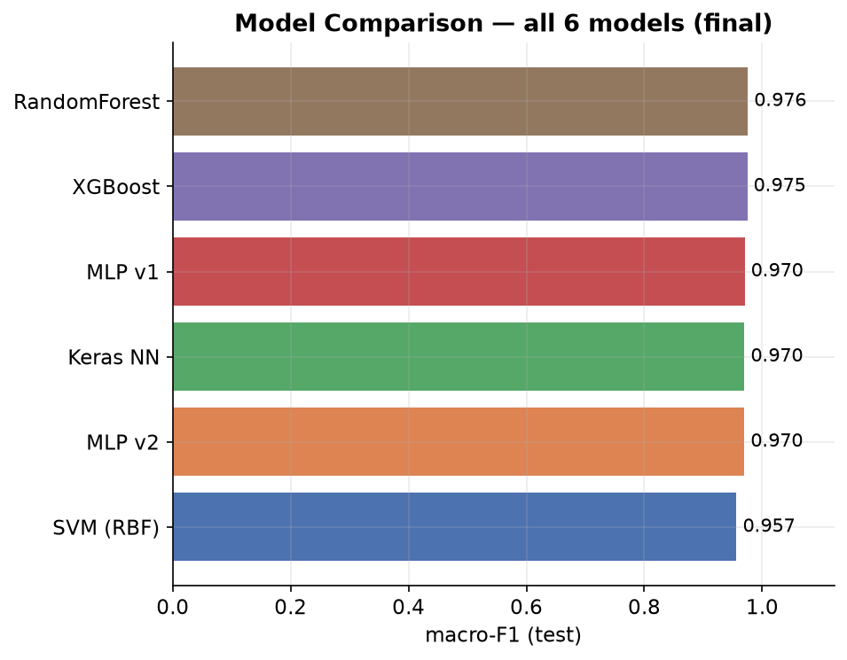
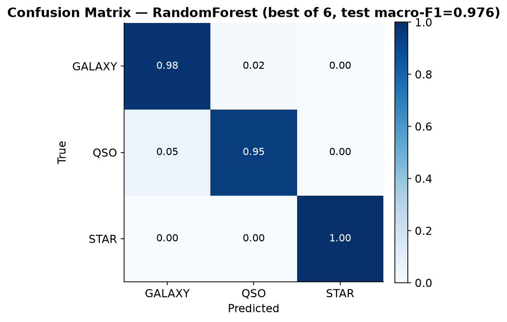

<!--
Owner: Person 1. All numbers below are final and sourced from
reports/tables/summary.csv and reports/preds/*.npz (all 6 models, final
one-time test run complete for every model as of this version).
-->

## 5. Results

### 5.1 Overall comparison

Six models in total — four reproduced baselines and two versions of the
custom MLP — were evaluated on the held-out test split under the shared
`evaluate()` function, using macro-F1 as the primary metric.

**Table 1.** Final test-set results (`reports/tables/summary.csv`).

| Model | val_f1 | test_f1 | accuracy |
|---|---|---|---|
| RandomForest | 0.97486 | **0.97569** | 0.97890 |
| XGBoost | 0.97647 | 0.97467 | 0.97780 |
| MLP v1 | 0.97068 | 0.97029 | 0.97390 |
| Keras NN | 0.96805 | 0.96988 | 0.97320 |
| MLP v2 | 0.97058 | 0.96977 | 0.97340 |
| SVM (RBF) | 0.96074 | 0.95650 | 0.96130 |

**RandomForest is the final best model** (test macro-F1 0.97569),
narrowly ahead of XGBoost (0.97467, −0.001) despite using only 6
hand-picked features against XGBoost's ~40 engineered ones. All six
models land within a 0.0192 band (0.95650–0.97569), and five of the
six sit within 0.006 of each other — strong evidence the task is
close to saturating on this feature set (`redshift` alone is highly
class-discriminative; see Limitations, Section 7).

The custom MLP does not beat the baselines: MLP v1 (0.97029) sits
between RandomForest/XGBoost and the Keras NN baseline, and the v1→v2
hyperparameter search produced a small *regression*, not an
improvement (test macro-F1 −0.00052; val macro-F1 −0.00010 during
selection — see Section 4 for the search details). Per the project's
own contingency plan, a null result from tuning is still a valid
outcome: the search covered 6 configurations varying width, dropout,
learning rate, and weight decay, and found nothing that beat the v1
reference on validation, consistent with the same saturation pattern
seen across all six models.

### 5.2 Error analysis

The confusion matrix above is for **RandomForest**, the final best
model by test macro-F1. As expected, the dominant error is **GALAXY
vs QSO** confusion — STAR is separated almost perfectly (recall
1.000), while GALAXY and QSO bleed into each other in both
directions.

**Per-class performance** (RandomForest, test set, n=10,000):

| Class | Precision | Recall | F1 |
|---|---|---|---|
| GALAXY | 0.984 | 0.981 | 0.982 |
| QSO | 0.947 | 0.949 | 0.948 |
| STAR | 0.994 | 1.000 | 0.997 |

The most confused pair is **GALAXY → QSO** (101 of 5,945 true GALAXY
rows, i.e. the reverse of QSO → GALAXY, which accounts for 5% of QSO
rows). Representative examples — all three misclassified with high
confidence (pred. probability ≈1.0 for QSO) share one trait: an
unusually high standardized `redshift` (≈1.56–1.75), well above the
typical GALAXY range and closer to where QSOs sit:

1. row 1093 — redshift z≈1.75 (standardized), predicted QSO with ~100% confidence
2. row 3003 — redshift z≈1.56
3. row 5821 — redshift z≈1.56

Since `redshift` is the single most informative feature for this task,
a galaxy with an atypically high redshift looks, in feature space,
much like a quasar — the model's error tracks a genuine physical
ambiguity rather than a modeling failure.

**Per-class performance** (RandomForest, test set, n=10,000):

| Class | Precision | Recall | F1 |
|---|---|---|---|
| GALAXY | 0.984 | 0.981 | 0.982 |
| QSO | 0.947 | 0.949 | 0.948 |
| STAR | 0.994 | 1.000 | 0.997 |

The most confused pair is **GALAXY → QSO** (101 of 5,945 true GALAXY
rows, i.e. the reverse of QSO → GALAXY, which accounts for 5% of QSO
rows). Representative examples — all three misclassified with high
confidence (pred. probability ≈1.0 for QSO) share one trait: an
unusually high standardized `redshift` (≈1.56–1.75), well above the
typical GALAXY range and closer to where QSOs sit:

1. row 1093 — redshift z≈1.75 (standardized), predicted QSO with ~100% confidence
2. row 3003 — redshift z≈1.56
3. row 5821 — redshift z≈1.56

Since `redshift` is the single most informative feature for this task,
a galaxy with an atypically high redshift looks, in feature space,
much like a quasar — the model's error tracks a genuine physical
ambiguity rather than a modeling failure.
